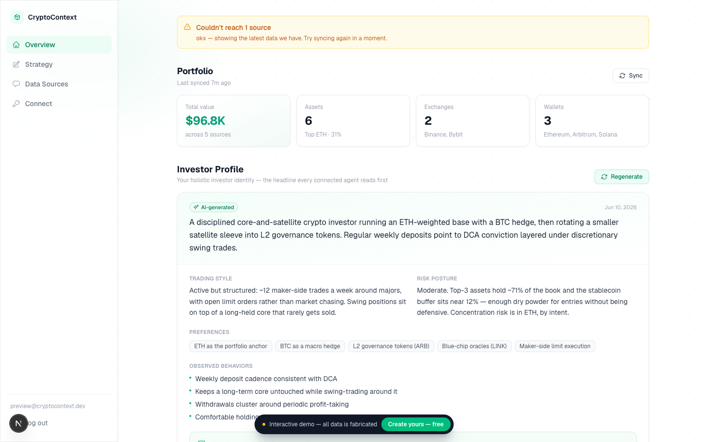

# CryptoContext

**Your AI gives generic advice because it can't see your bags.**

CryptoContext unifies your entire crypto footprint — every exchange, every wallet, plus *how* you trade and *what your strategy is* — into one structured context that any AI agent can read. Connect once, and Claude, Cursor, ChatGPT, or any agent stops guessing and starts reasoning about your *actual* portfolio.

> **Not your context, not your AI.** Open source, MCP-native, runs for $0. Point it at any agent you choose — your context comes with you.

**Try it without signing up**: [cryptocontext.earthonline.site/demo](https://cryptocontext.earthonline.site/demo) · **App**: [cryptocontext.earthonline.site](https://cryptocontext.earthonline.site) · **Security**: [SECURITY.md](SECURITY.md) · **License**: [MIT](LICENSE)



---

## The problem

Your money is scattered across Binance, a Bybit account, a cold wallet, and a Solana address. No AI knows what you actually hold, so every "should I rebalance?" answer is a generic textbook reply. Pasting positions into a chat by hand is tedious, instantly stale, and still misses how you trade — and you re-explain your strategy to every new model.

## What it does

Once connected, your agent can answer questions like *"be honest, what's wrong with my portfolio?"* with specifics:

> Your conviction and your attention are in different places — BTC + ETH are 70% of your book, but 11 of your last 14 trades were memes. Stablecoins are 3%, so you have no dry powder for the dips you historically buy. Your weekly ETH DCA is disciplined, though — you're in accumulation mode.

That answer requires knowing your holdings, your concentration, your trade history, your fund flows, and your stated strategy — across every venue at once. That's what CryptoContext assembles.

## Use it anywhere

Three integration forms, pick whichever fits the AI you live in:

1. **MCP** (Claude Code, Cursor, ChatGPT Developer Mode, any MCP client) — one command, live context on demand.
2. **Portable skill** — download `crypto-context.zip` from the dashboard; works in Claude Code, Claude.ai, and OpenClaw (any `SKILL.md` runner). It curls your live context with a token you keep in an env var.
3. **One-click copy-paste** — the dashboard assembles your full context as markdown; paste it into any chat. Zero setup.

## Why it's different

- **Built for AI, not for staring.** It's not another dashboard. Your positions become clean, queryable context an agent can reason over — concentration, allocation, risk flags — not a chart you interpret yourself.
- **Knows how you trade, not just what you hold.** Trading patterns, DCA habits, fund flows — so advice is about *you*, not a generic investor.
- **Your strategy, in your own words.** A built-in strategy notebook rides along with every context, so you never re-explain your thesis to a new model. Write it in English or 中文 — the AI investor profile follows your language.
- **Every venue, one picture.** 16 exchanges + 8 chains (EVM + Solana) unified into a single complete view. Comprehensiveness is the whole point.
- **Grounded numbers, AI-written profile.** Holdings, concentration and trading stats are computed locally into hard facts. A free LLM then reads only that aggregated shape — never your keys or addresses — to write a rich investor profile. The numbers stay deterministic; the interpretation is smart.
- **Honest about freshness.** Every venue in the context carries its status — live, cached snapshot, or unreachable — and per-source sync times, so your AI knows when the picture is complete and never mistakes "couldn't fetch" for "holds nothing".
- **Open source and read-only.** Read-only API keys, encrypted at rest. Don't trust us — [read the code](SECURITY.md) or self-host.
- **No lock-in, by design.** You own the context layer and point it at any agent. Switch models freely; your context follows you.

## Quickstart — use the hosted version

1. Click around the [no-signup demo](https://cryptocontext.earthonline.site/demo) first if you like.
2. Sign up at [cryptocontext.earthonline.site](https://cryptocontext.earthonline.site) and connect a wallet address (zero risk) or an exchange with a **read-only** API key.
3. Create an MCP token in the dashboard → Connect.
4. Add it to your agent:

```bash
claude mcp add --transport http crypto-ctx \
  https://cryptocontext.earthonline.site/api/mcp \
  --header "Authorization: Bearer YOUR_TOKEN"
```

Or in any MCP client config:

```json
{
  "mcpServers": {
    "crypto-context": {
      "url": "https://cryptocontext.earthonline.site/api/mcp",
      "headers": { "Authorization": "Bearer YOUR_TOKEN" }
    }
  }
}
```

The dashboard shows your exact command with your endpoint and token filled in — plus the copy-paste and skill options.

## Quickstart — self-host (trust no one)

The strongest answer to "is this safe with my keys?" is running it yourself. You hold the encryption key and the database; no third party has any access.

```bash
git clone https://github.com/EarthOnlineLabs/crypto-context.git
cd crypto-context
cp .env.example .env.local        # fill in the values below
pnpm install                      # or npm install
pnpm dev
```

You'll need a (free) [Supabase](https://supabase.com) project. Apply [`supabase-schema.sql`](supabase-schema.sql) to create the tables and row-level-security policies, then set:

| Variable | Purpose | Format |
|----------|---------|--------|
| `NEXT_PUBLIC_SUPABASE_URL` | Supabase project URL | `https://xxx.supabase.co` |
| `NEXT_PUBLIC_SUPABASE_ANON_KEY` | Supabase anon key | JWT string |
| `SUPABASE_SERVICE_ROLE_KEY` | Service role (used by the MCP endpoint) | JWT string |
| `ENCRYPTION_KEY` | AES-256-GCM key encrypting your API keys | **Exactly 64 hex chars** |
| `GLM_API_KEY` *(optional)* | Free LLM for the investor profile ([bigmodel.cn](https://open.bigmodel.cn)) | string — omit to use the deterministic profile |

Generate the encryption key with:

```bash
node -e "console.log(require('crypto').randomBytes(32).toString('hex'))"
```

Deploy anywhere that runs Next.js. It's tuned for Vercel's free tier — total cost to run is **$0/month**.

## How it works

1. **Connect your venues.** Add exchanges with a read-only API key. For wallets, pick your app (MetaMask, Phantom, …) and paste the address — one EVM address is scanned across all 7 chains and added wherever it holds value. The app can never trade or withdraw — [read-only, always](SECURITY.md).
2. **Context is auto-generated.** Holdings, concentration, trading patterns, and fund flows are computed locally into hard facts; an LLM reads only that aggregated shape — never your keys or addresses — to write your investor profile. Your strategy notes ride along verbatim. Refreshed on every sync.
3. **Any AI reads it.** Over MCP, as a portable skill, or pasted directly. All sources are fetched in parallel with per-source budgets and a snapshot fallback, so the answer comes fast even when one venue is slow.

## Supported venues

**Exchanges (16):** Binance, OKX, Bybit, Coinbase, Kraken, Bitget, KuCoin, Gate.io, HTX, MEXC, Crypto.com, BingX, Bitfinex, Gemini, Bitstamp, Upbit.
OKX / Bitget / KuCoin also require the API passphrase.

**Wallets (8 chains):** Ethereum, BNB Chain, Polygon, Arbitrum, Base, Optimism, Avalanche C-Chain, and **Solana** (native SOL + all SPL tokens).

## Security

CryptoContext is built to be trusted with exchange keys:

- **Read-only by design** — the code only calls read endpoints; no `createOrder`/`withdraw`/`transfer` anywhere ([verify with one grep](SECURITY.md#what-cryptocontext-can-and-cannot-do)).
- **AES-256-GCM** encryption at rest, unique IV per record, key held only in an env var.
- **Row-level security** so accounts are fully isolated; MCP tokens stored as **SHA-256 hashes**.
- HTTPS-only, rate limiting, input validation, error sanitization.

Full details and threat model: **[SECURITY.md](SECURITY.md)**.

## Tech stack

| Component | Solution | Cost |
|-----------|----------|------|
| Frontend + API | Next.js 16 (App Router, Tailwind v4) | Free (Vercel) |
| Database + Auth | Supabase (PostgreSQL + RLS) | Free |
| Exchange data | CCXT v4.5 | Free |
| Wallet data | viem (EVM) + @solana/web3.js | Free |
| Investor profile LLM | GLM-4.7-Flash (free tier) | Free |
| MCP protocol | HTTP transport, JSON-RPC 2.0 | — |
| Key encryption | AES-256-GCM | — |

**Total: $0/month.**

## API

**MCP discovery** — `GET /api/mcp` returns server info and available tools.

**MCP tools** — `POST /api/mcp` (auth: `Authorization: Bearer <mcp_token>`):

| Tool | Description |
|------|-------------|
| `get_portfolio` | Current holdings with USD values and allocation %. Optional: filter by asset. |
| `get_context` | Full investor context — profile + strategy notes + portfolio + trading patterns + fund flows. |

**Context export** — `GET /api/context/full` (same Bearer auth) returns the full assembled context as `text/markdown`. This is what the portable skill curls.

## Project structure

```
src/
├── app/
│   ├── page.tsx              # Landing page
│   ├── demo/                 # Public no-signup interactive demo (fabricated data)
│   ├── dashboard/            # Overview, strategy notes, sources, connect
│   └── api/
│       ├── auth/             # login, logout, signup
│       ├── exchange/         # connect, disconnect, portfolio, sync
│       ├── wallet/           # connect, disconnect, portfolio
│       ├── notes/            # strategy notes (GET/PUT)
│       ├── context/full/     # full context export (markdown)
│       └── mcp/              # MCP JSON-RPC endpoint + token management
├── lib/
│   ├── exchange.ts           # CCXT wrapper — balances & bulk pricing (read-only)
│   ├── exchange-history.ts   # Trade / deposit / withdrawal history (read-only)
│   ├── chains.ts · chains/   # EVM + Solana wallet fetchers
│   ├── generators/           # Trading profile, fund flow, GLM investor profile
│   ├── context.ts            # Context document assembly
│   ├── context-assembler.ts  # Parallel fetch + snapshot fallback + full assembly
│   ├── crypto.ts             # AES-256-GCM encryption
│   ├── security.ts           # Rate limiting, validation, error sanitization, headers
│   ├── store.ts              # Supabase data layer
│   └── supabase/             # Supabase clients
└── middleware.ts             # Auth, security headers, canonical-host redirect
```

## Contributing & disclosure

Issues and PRs welcome. For **security** issues, please don't open a public issue — see the disclosure process in [SECURITY.md](SECURITY.md#reporting-a-vulnerability).

## License

[MIT](LICENSE) © 2026 [0xrikt](https://github.com/0xrikt)
